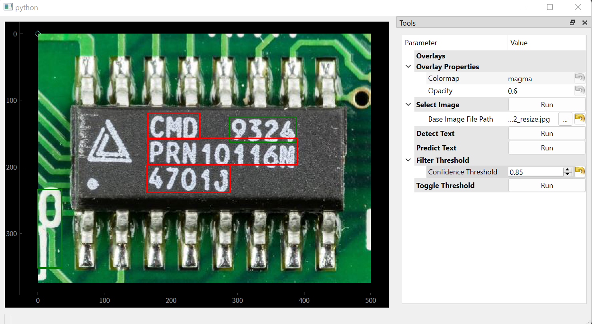

# OCR Visualization Application


### Sample Results


*Hover over bounding boxes to display predicted text and confidence value*




## Getting Started
### Create Environment
```
conda create -n env python=3.10 -y
conda activate env
```
### Install dependencies
```
pip install -r requirements.txt
```
### Execute Application
```
python realtime_ocr_visualization.py
```